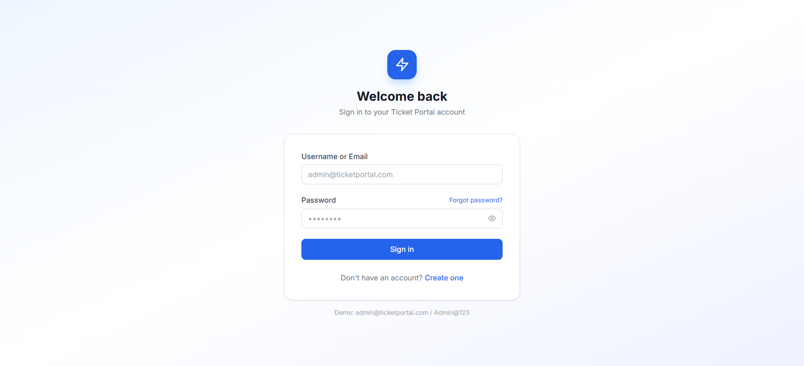
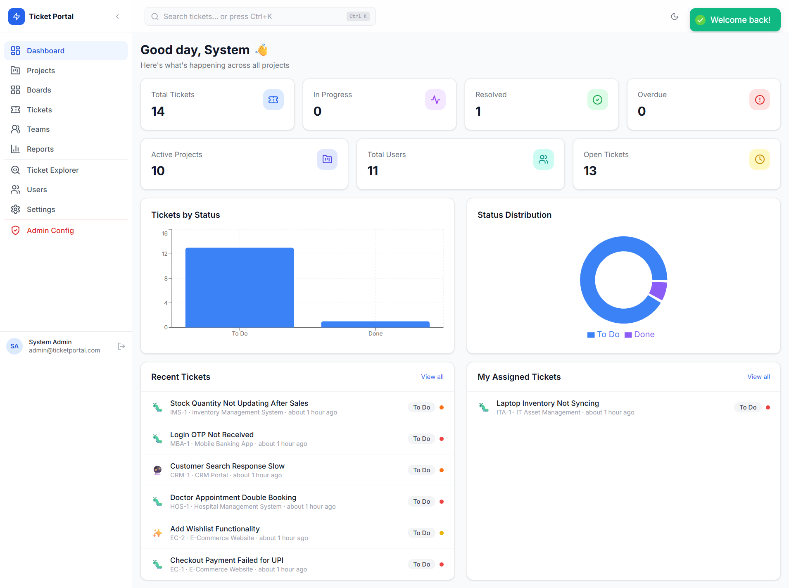
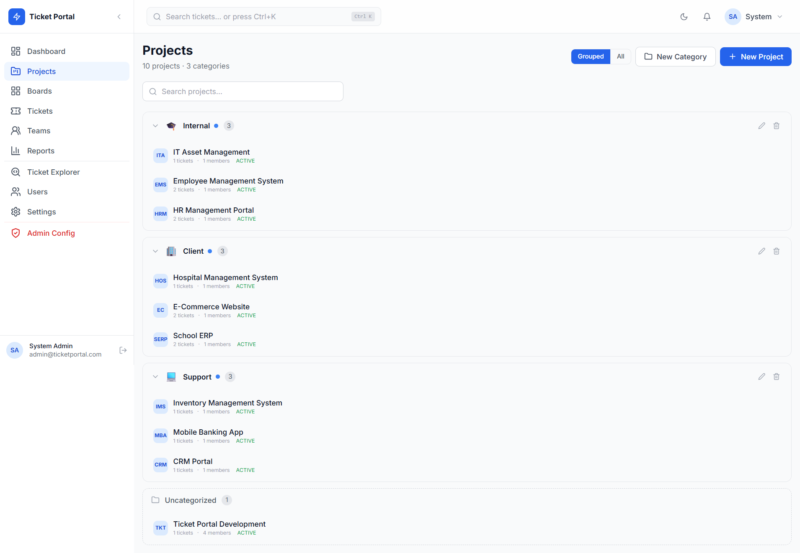
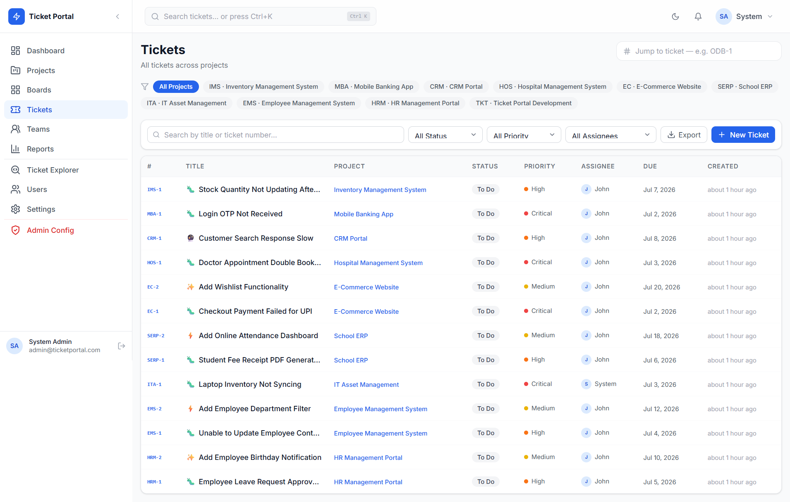
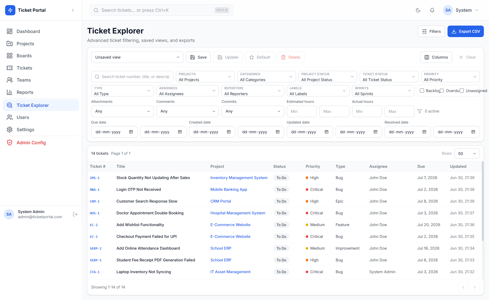

# IssueHub

> **A full-stack enterprise ticket and project management platform built
> with Java, Spring Boot, React, and PostgreSQL.**

IssueHub is designed for software development teams to efficiently
manage projects, sprints, tickets, workflows, team collaboration, and
reporting. It provides secure JWT authentication, role-based access
control, Kanban boards, sprint planning, notifications, file uploads,
dashboards, and more.

------------------------------------------------------------------------

# 🚀 Live Demo

### 🌐 Frontend (Vercel)

https://project-xpi6j.vercel.app

### ⚙️ Backend API (Render)

https://issuehub-backend-owwc.onrender.com

### 📚 Swagger Documentation

https://issuehub-backend-owwc.onrender.com/api/swagger-ui/index.html

------------------------------------------------------------------------

# ☁️ Deployment

  Service    Platform
  ---------- -----------------
  Frontend   Vercel
  Backend    Render
  Database   Neon PostgreSQL

------------------------------------------------------------------------

# 🏗️ System Architecture

``` text
Users
  │
  ▼
React + Vite Frontend (Vercel)
  │
REST API (Axios + JWT)
  │
  ▼
Spring Boot Backend (Render)
  │
Spring Data JPA / Hibernate
  │
  ▼
PostgreSQL Database (Neon)
```

------------------------------------------------------------------------

# ✨ Features

## Authentication

-   JWT Authentication
-   User Registration
-   Login
-   Logout
-   Refresh Token

## User Roles

-   Admin
-   Manager
-   Developer
-   Tester

## Dashboard

-   Project statistics
-   Ticket statistics
-   Sprint overview
-   Team overview

## Project Management

-   Create, update and archive projects
-   Categories & labels
-   Member management

## Ticket Management

-   Ticket creation & assignment
-   Priority & status tracking
-   Comments
-   Attachments
-   Time logs
-   Ticket history
-   Bulk updates

## Sprint Management

-   Sprint planning
-   Active sprint
-   Backlog
-   Complete sprint

## Kanban Board

-   Drag & Drop workflow

## Team Management

-   Team creation
-   Member management

## Notifications

-   Notification tracking

## Reporting

-   Dashboard reports
-   Ticket reports
-   Sprint reports

## Administration

-   Admin settings
-   Database patch management

------------------------------------------------------------------------

# 🛠️ Tech Stack

## Backend

-   Java 21
-   Spring Boot 3
-   Spring Security
-   JWT Authentication
-   Spring Data JPA
-   Hibernate
-   PostgreSQL
-   Gradle
-   Lombok
-   ModelMapper
-   Swagger

## Frontend

-   React 18
-   Vite
-   Redux Toolkit
-   React Router
-   TanStack Query
-   Axios
-   Tailwind CSS
-   React Hook Form
-   Zod
-   Recharts
-   dnd-kit
-   Radix UI

## Database

-   PostgreSQL (Neon)

## Hosting

-   Vercel
-   Render
-   Neon

------------------------------------------------------------------------

# 📂 Project Structure

``` text
IssueHub/
├── backend/
├── frontend/
├── README.md
└── SETUP.md
```

------------------------------------------------------------------------

# 💻 Local Setup

## Prerequisites

-   Java 21
-   Node.js 20+
-   PostgreSQL 14+

## Clone Repository

``` bash
git clone https://github.com/pushpak90/IssueHub.git
cd IssueHub
```

## Backend

``` bash
cd backend
./gradlew bootRun
```

Windows:

``` cmd
gradlew.bat bootRun
```

Backend URL: `http://localhost:8080/api`

Swagger: `http://localhost:8080/api/swagger-ui.html`

## Frontend

``` bash
cd frontend
npm install
npm run dev
```

Frontend URL: `http://localhost:5173`

## Environment Variables

Backend:

``` properties
DB_URL=jdbc:postgresql://<host>:5432/<database>
DB_USERNAME=<username>
DB_PASSWORD=<password>
JWT_SECRET=<your-secret>
```

Frontend:

``` env
VITE_API_BASE_URL=http://localhost:8080/api
```

------------------------------------------------------------------------

# 🔐 Security

-   Spring Security
-   JWT Authentication
-   Role-Based Access Control (RBAC)
-   Protected REST APIs

------------------------------------------------------------------------

# 📷 Screenshots

Add screenshots here:

## Login


## Dashboard


## Project


## Ticket


## Report


------------------------------------------------------------------------

# 🚀 Future Enhancements

-   WebSocket Notifications
-   Email Notifications
-   Docker
-   Kubernetes
-   CI/CD Pipeline
-   Audit Logs

------------------------------------------------------------------------

# 👨‍💻 Author

**Pushpak Ashwin Fasate**

GitHub: https://github.com/pushpak90

------------------------------------------------------------------------

# 📄 License

MIT License
